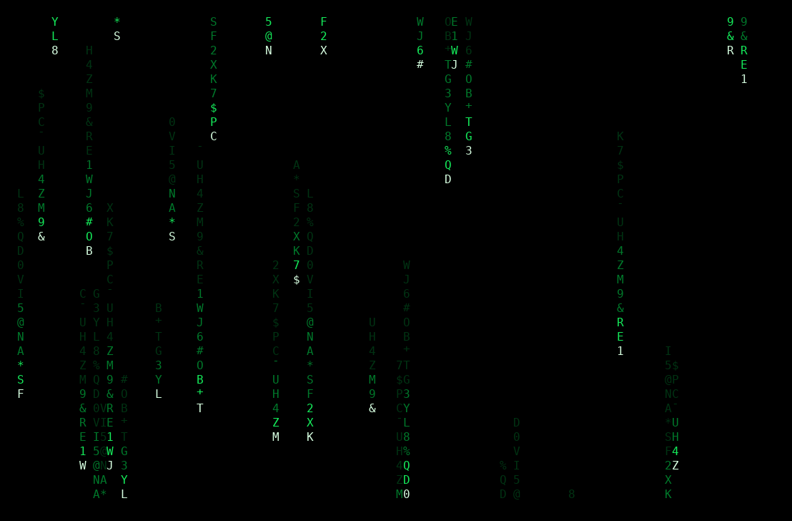

<h1 align="center">Lluvia Verde</h1>

<p align="center">
  A Matrix-style green rain effect for PowerShell terminals.
</p>

---

Lluvia Verde renders falling characters directly in a VT-compatible terminal and restores the original screen when the animation exits normally.

## Install

```powershell
git clone https://github.com/delriscotechnologies/lluviaverde.git
cd lluviaverde
.\lluviaverde.ps1
```

## Output

Lluvia Verde displays the animation in the terminal. It does not create reports, logs, or other output files.


